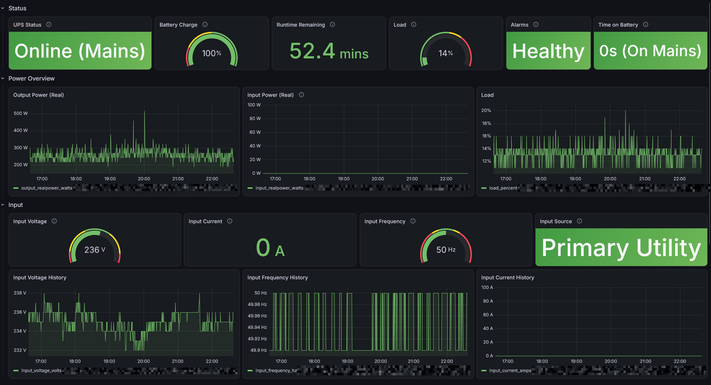
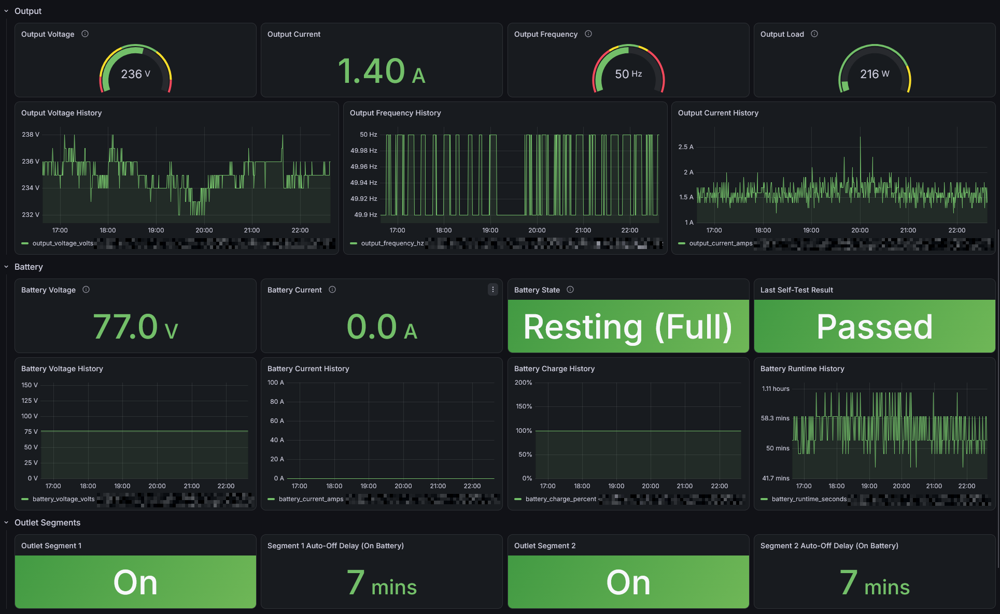
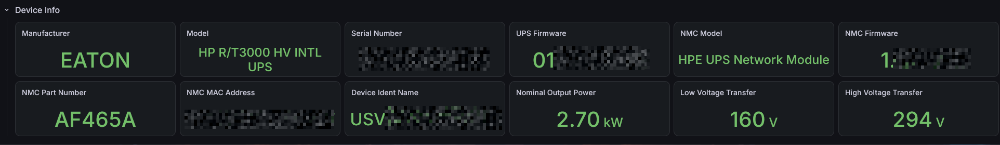

# HP R/T3000 UPS Monitoring

A dashboard to display data from my HP R/T3000 HV INTL UPS (G4, Eaton-manufactured, HP UPS Network Module AF465A) scraped via SNMP by Telegraf, stored in InfluxDB, and visualized in Grafana.

See [METRICS.md](./METRICS.md) for the full field-by-field reference: every OID, its source MIB, unit/scaling, and why it was (or wasn't) included.

### Info




### Updates

- **13.09.2026**
  - Initial version
  - Set `agent_host_tag = "source"` on all SNMP blocks to silence a Telegraf deprecation warning
  - Removed `output_apparentpower_va` (and the "Real vs Apparent Power" panel) - live paired `snmpget`s proved this device reports the identical raw value for both its "real" and "apparent" output power OIDs, so the field added no information
  - Fixed all Device Info panels showing "No data" - Grafana's Stat/Gauge `reduceOptions.fields` was left at its default `""`, which only matches numeric fields; string-valued panels (manufacturer, model, serial number, firmware versions, MAC, part number) need it set to `"/^Value$/"` to be picked up at all. Confirmed via Grafana's query inspector that the query itself was always returning correct data - this was a dashboard panel config bug, not an SNMP/Telegraf/InfluxDB issue.
  - `input_current_amps`/`input_realpower_watts`: briefly removed after reading `0` on every live check, then **re-added** after research showed other HP R/T3000 units (including a G2 on the identical MIB tree) report this metric successfully - it's very likely specific to this unit (bought used, known pre-existing battery defect) rather than a model limitation. See [METRICS.md](./METRICS.md#known-open-issue-input-currentpower-reads-0-on-this-specific-unit).

### Device

| | |
|---|---|
| Model | HP R/T3000 HV INTL UPS (G4), part number J2R04A |
| Actual manufacturer | Eaton (HP/HPE rebadge) |
| Capacity | 3000VA / 2700W, line-interactive |
| Network management card | HP UPS Network Module, part number AF465A, firmware 1.13.001 |
| Battery | 6x 12V 9Ah VRLA AGM in series (72V nominal string) |
| SNMP | v3, `authNoPriv`, MD5 |
| MIBs used | Standard UPS-MIB (RFC 1628, `1.3.6.1.2.1.33`) + HP/Compaq CPQPOWER-MIB (`1.3.6.1.4.1.232.165`) |

### Steps

```
1. Create a new InfluxDB Bucket

2. Create a new Telegraf Config in InfluxDB WebUI

3. Paste everything after the "START" comment from `telegraf.conf`, use the
   full config as reference when not using the InfluxDB WebUI to create the
   Telegraf config.

4. Set the UPS IP address, hostname tag, and SNMPv3 credentials in
   `telegraf.conf` to match your device. The auth password is read from the
   $UPS_SNMP_AUTH_PASSWORD environment variable - do not commit it in plaintext.

5. Import the Grafana Dashboard and select the Bucket defined in Telegraf.

6. All variables (bucket, hostname) should populate automatically from there
   on, though different configurations may introduce issues, so feel free to
   report them via GitHub Issues.

7. Enjoy
```

[How to: Add InfluxDB Datasource to Grafana](https://grafana.com/docs/grafana/latest/datasources/influxdb/configure/)

### Testing SNMP manually

Before trusting the dashboard, confirm the device answers on both MIB trees used by `telegraf.conf`:

```bash
snmpwalk -v3 -u readuser -l authNoPriv -a MD5 -A '<password>' <UPS_IP> 1.3.6.1.2.1.33
snmpwalk -v3 -u readuser -l authNoPriv -a MD5 -A '<password>' <UPS_IP> 1.3.6.1.4.1.232.165
```

To check a single OID (e.g. current operating mode):

```bash
snmpget -v3 -u readuser -l authNoPriv -a MD5 -A '<password>' <UPS_IP> 1.3.6.1.4.1.232.165.3.4.5.0
```

### Validating Telegraf

Run Telegraf once in test mode to see exactly what it would send, without writing to InfluxDB:

```bash
telegraf --config telegraf.conf --test
```

Check that every measurement (`snmp_ups_status`, `snmp_ups_electrical`, `snmp_ups_outlet`, `snmp_ups_identity`) appears with the `hostname` tag set and plausible field values (compare against your own `snmpwalk` output and [METRICS.md](./METRICS.md)).

### Troubleshooting missing metrics

- **A field is missing entirely**: run `snmpget` for that field's OID directly (see [METRICS.md](./METRICS.md) for the OID). If it times out or returns `No Such Object`, your device/firmware doesn't expose it - remove it from `telegraf.conf` rather than leaving a permanently-failing field.
- **A field always reads `0` where a real value is expected**: this is the same pattern that caused ambient temperature to be excluded from this build - it usually means an optional accessory (e.g. a temperature/humidity probe) isn't physically connected, not a config error.
- **SNMPv3 auth failures**: confirm `sec_name`/`auth_protocol`/`sec_level` in `telegraf.conf` match exactly what's configured on the UPS Network Module's web UI, and that `$UPS_SNMP_AUTH_PASSWORD` is actually set in Telegraf's environment.
- **Values look scaled wrong (10x too big/small)**: check the `conversion` field next to that OID in `telegraf.conf` and cross-reference the unit noted in [METRICS.md](./METRICS.md) - several fields are documented in tenths (0.1V, 0.1A, 0.1Hz) and require `conversion = "float(1)"`.
